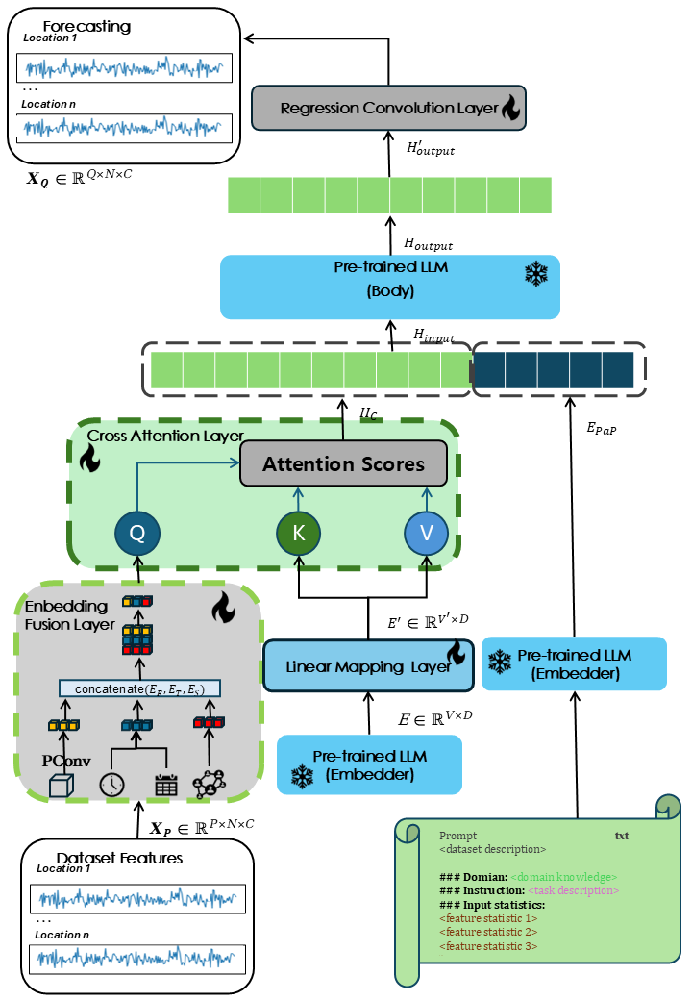

## Reprogramming Large Language Models for Spatia-Temporal Traffic Flow Forecasting
# The framework of STF-GPT2

# Dataset
| **Dataset**             | **CitiBike**             | **NYCTaxi**              |
|:------------------------|:------------------------:|-------------------------:|
| **Total**               | 2.6 million              | 35 million               |
| **Number of Nodes**     | 250                      | 266                      |
| **Time Span**           | 01/04/2016 - 30/06/2016  | 01/04/2016 - 30/06/2016  |
| **Timestep**            | 30 minutes               | 30 minutes               |
| **Number of Timesteps** | 4368                     | 4368                     |

# Setup
Before training, please configure the following training dictionary:  
config = {  
    "file_dir": "CitiBike_dataset/bike_pick/",  # Path to dataset (CitiBike_dataset or NYCTaxi_dataset)  
    "epochs": 300,                              # Number of training epochs  
    "num_nodes": 250,                           # Number of spatial nodes (250 for CitiBike, 266 for NYCTaxi)  
    "lrate": 1e-3,                              # Learning rate  
    "batch_size": 64,                           # Batch size  
    "input_dim": 3,                             # Number of input features  
    "clip": 5.0,                                # Gradient clipping norm  
    "es_patience": 100,                         # Early stopping patience (epochs)  
    "input_len": 12,                            # Input sequence length  
    "output_len": 12,                           # Prediction sequence length  
    "wdecay": 0.0001,                           # Weight decay for regularization  
    "save": "./",                               # Output directory for saved files  
    }
